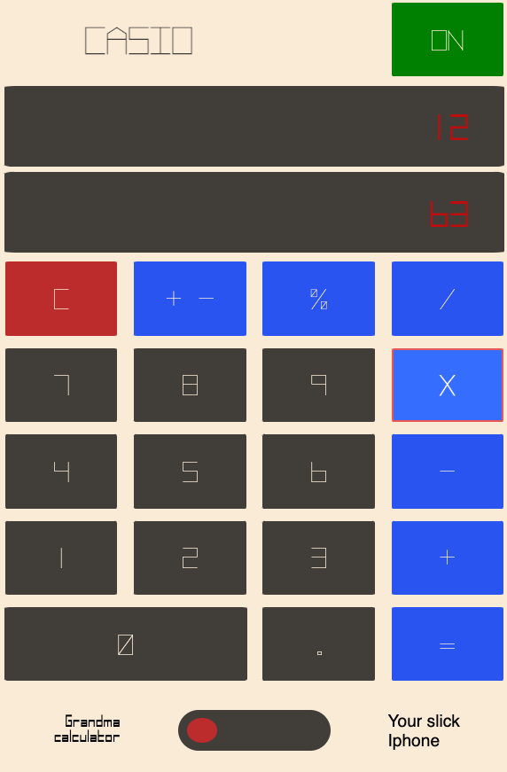
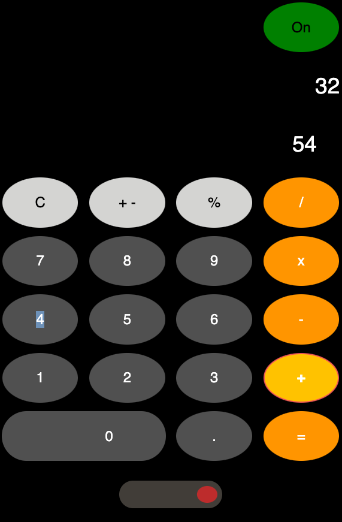

<h1>DOM calculator  </h1>

As a challenge to test our understandment of JS, DOM manipulation and CSS during the _Nology course we were asked to build a calculator. This were the specificications for the project:
<ul>
    <li>A calculator that accept a minimum of 2 inputs;</li>
    <li>build with JS, HTML and CSS/SASS;</li>
    <li>deployed on GitHup pages;</li>
    <li>made at least 15 meaningful commits;</li>
    <li>code formatted correctly;</li>
    <li>build with a mobile first approach;</li>
    <li>does not use eval();</li>
</ul>

<h2>Table of contents</h2>
<ul>
    <li>General Info</li>
    <li>Technologies</li>
    <li>Setup</li>
    <li>Status</li>
    <li>Future development</li>
</ul>

<h2>General Info</h2>

The calculator can do consecutives operations but at the moment accept only two input per each operation. Commas are added automatically and the them can be changed at user discretion.

<h2>Technologies</h2>

The calculator was built with:

<ul>
    <li>Javascript</li>
    <li>HTML</li>
    <li>CSS / SASS</li>
</ul>

<h2>Setup</h2>

Just access the calculator on GitHub pages <a href="https://martinelli-89.github.io/calculator/">(link)</a> and have fun!

<h2>Status</h2>

The calculator is working. I would like to give the user the possiblity to do operations with more than two numbers per time. Currently the calculator also return NaN if you divide by zero, issue thay I have to resolve.
 

<h5>Thanks for checking my project. If you find any bug I didn't notice or have any suggestion please reach out :)<h5>
